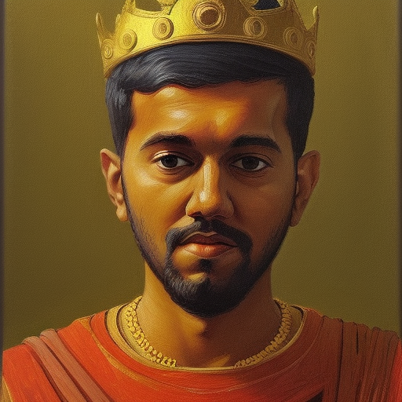

```{=html}
<canvas id="matrix" aria-hidden="true"></canvas>

<section class="hero">

  <div class="term" id="shell">
    <div class="term-bar">
      <span class="dot r"></span><span class="dot y"></span><span class="dot g"></span>
      <span class="term-title">king@utopia: ~ — zsh — 80×24</span>
    </div>
    <div class="term-body" id="shell-body">
      <!-- static fallback; replaced by the live shell when JavaScript runs -->
      <pre class="ascii-banner">██╗   ██╗████████╗ ██████╗ ██████╗ ██╗ █████╗
██║   ██║╚══██╔══╝██╔═══██╗██╔══██╗██║██╔══██╗
██║   ██║   ██║   ██║   ██║██████╔╝██║███████║
██║   ██║   ██║   ██║   ██║██╔═══╝ ██║██╔══██║
╚██████╔╝   ██║   ╚██████╔╝██║     ██║██║  ██║
 ╚═════╝    ╚═╝    ╚═════╝ ╚═╝     ╚═╝╚═╝  ╚═╝</pre>
      <div class="sh-line"><span class="sh-prompt">king<span class="sh-dim">@</span><span class="host">utopia</span>:<span class="path">~</span>$</span> whoami</div>
      <div class="sh-line">Suchith Prabhu — King of Utopia, PhD scholar in extreme classification.</div>
      <div class="sh-line"><span class="sh-prompt">king<span class="sh-dim">@</span><span class="host">utopia</span>:<span class="path">~</span>$</span> ls</div>
      <div class="sh-line"><a class="sh-link" href="research_blog.html">workshop/</a>  <a class="sh-link" href="adventure_blog.html">expeditions/</a>  <a class="sh-link" href="about.html">king.md</a>  <a class="sh-link" href="data/suchith_prabhu_cv.pdf">cv.pdf</a></div>
    </div>
  </div>

  <div class="term portrait" id="portrait">
    <div class="term-bar">
      <span class="dot r"></span><span class="dot y"></span><span class="dot g"></span>
      <span class="term-title">~/portraits/his_majesty.png</span>
    </div>
    <div class="term-body">
      <div class="portrait-img">
        
        <div class="scan"></div>
      </div>
      <div class="portrait-meta">
        <span class="k">name</span><span class="v">Suchith Prabhu</span>
        <span class="k">title</span><span class="v">King of Utopia</span>
        <span class="k">uid</span><span class="v">0 <span class="u-muted">(root)</span></span>
        <span class="k">day job</span><span class="v">PhD scholar · IIT Delhi</span>
        <span class="k">research</span><span class="v">extreme classification</span>
      </div>
    </div>
  </div>

</section>

<div class="section-label">// the realm</div>

<nav class="realm" aria-label="Sections of the site">
  <a class="realm-tile reveal" href="research_blog.html">
    <div class="rt-perm">drwxr-xr-x  king</div>
    <div class="rt-icon">⚗</div>
    <div class="rt-name">~/workshop</div>
    <div class="rt-desc">The Alchemist's Workshop. Models built from scratch, experiments and ideas made real.</div>
    <span class="rt-go">cd workshop →</span>
  </a>
  <a class="realm-tile reveal" href="adventure_blog.html">
    <div class="rt-perm">drwxr-xr-x  king</div>
    <div class="rt-icon">⛰</div>
    <div class="rt-name">~/expeditions</div>
    <div class="rt-desc">Roaming Beyond Borders. Stories, photos and misadventures from life outside the lab.</div>
    <span class="rt-go">cd expeditions →</span>
  </a>
  <a class="realm-tile reveal" href="about.html">
    <div class="rt-perm">-rw-r--r--  king</div>
    <div class="rt-icon">♛</div>
    <div class="rt-name">~/king.md</div>
    <div class="rt-desc">The dossier on the ruler: research, publications, education and lore.</div>
    <span class="rt-go">cat king.md →</span>
  </a>
  <a class="realm-tile reveal" href="data/suchith_prabhu_cv.pdf">
    <div class="rt-perm">-r--r--r--  king</div>
    <div class="rt-icon">⎙</div>
    <div class="rt-name">~/cv.pdf</div>
    <div class="rt-desc">The royal résumé: everything above in one printable scroll.</div>
    <span class="rt-go">open cv.pdf →</span>
  </a>
</nav>

<div class="section-label">// royal decree</div>

<div class="term decree reveal">
  <div class="term-bar">
    <span class="dot r"></span><span class="dot y"></span><span class="dot g"></span>
    <span class="term-title">/etc/utopia/decree.md</span>
  </div>
  <div class="term-body">
    <p class="c">/* "Life is a journey, and if you fall in love with the journey,<br>&nbsp;&nbsp;&nbsp;you will be in love forever." — Peter Hagerty */</p>
    <p><span class="kw">const</span> <span class="fn">utopia</span> = { <span class="str">kindness</span>, <span class="str">fairness</span>, <span class="str">unity</span> };</p>
    <p>Hi, I am your King Suchith, and I welcome you all to <span class="u-green">Utopia</span>. It is a world where people support one another, value equality and respect, and work together to grow. Education, creativity and personal growth are encouraged here. Living in harmony with nature and with each other makes happiness a way of life, not just a goal.</p>
    <p>Beyond ruling Utopia, I am a <span class="u-gold">PhD scholar working on extreme classification</span>, exploring the frontiers of machine learning for real-world impact. In my free time I paint, play tennis and practise the <span class="u-gold">tabla</span>, an art form close to my heart. Through this website I share my research, art, music and movement, and I invite you to join me in learning, creating and discovering.</p>
    <div class="stat-strip">
      <span>research: <b>extreme classification</b></span>
      <span>lab: <b>School of AI, IIT Delhi</b></span>
      <span>hobbies: <b>tennis · tabla · painting</b></span>
      <span>status: <b>hunting the next adventure</b></span>
    </div>
  </div>
</div>

<div class="section-label">// latest transmissions</div>
```

::: {#latest .listing-compact}
:::
