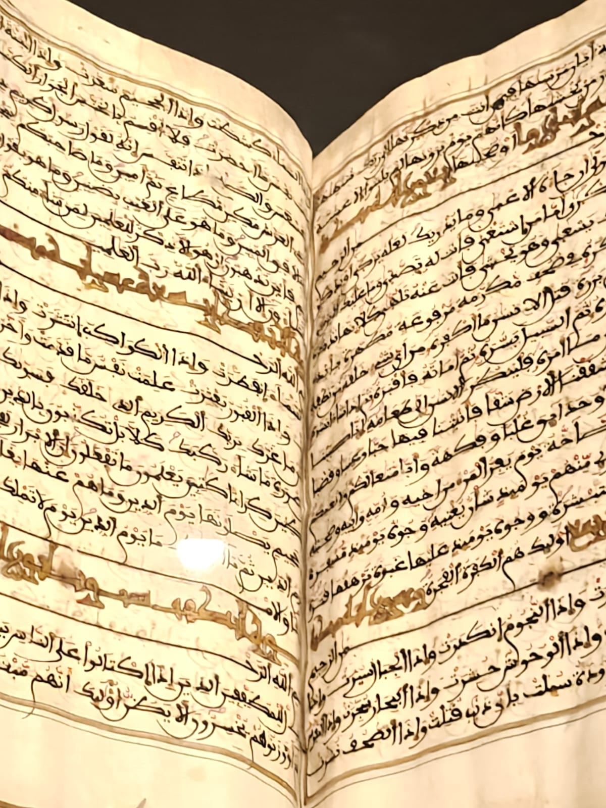
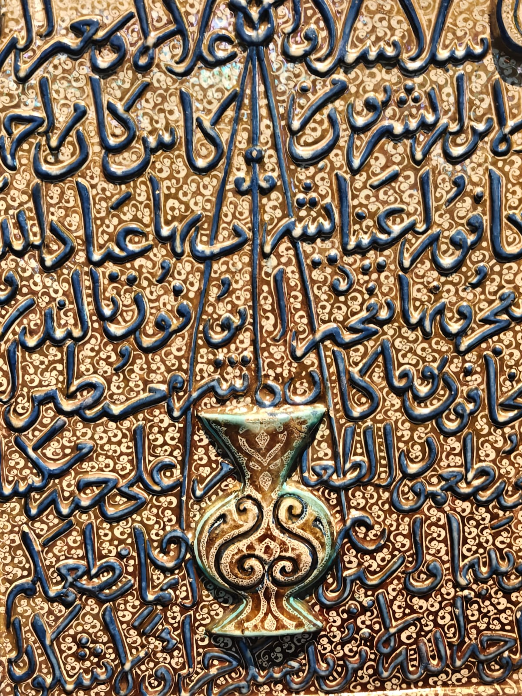
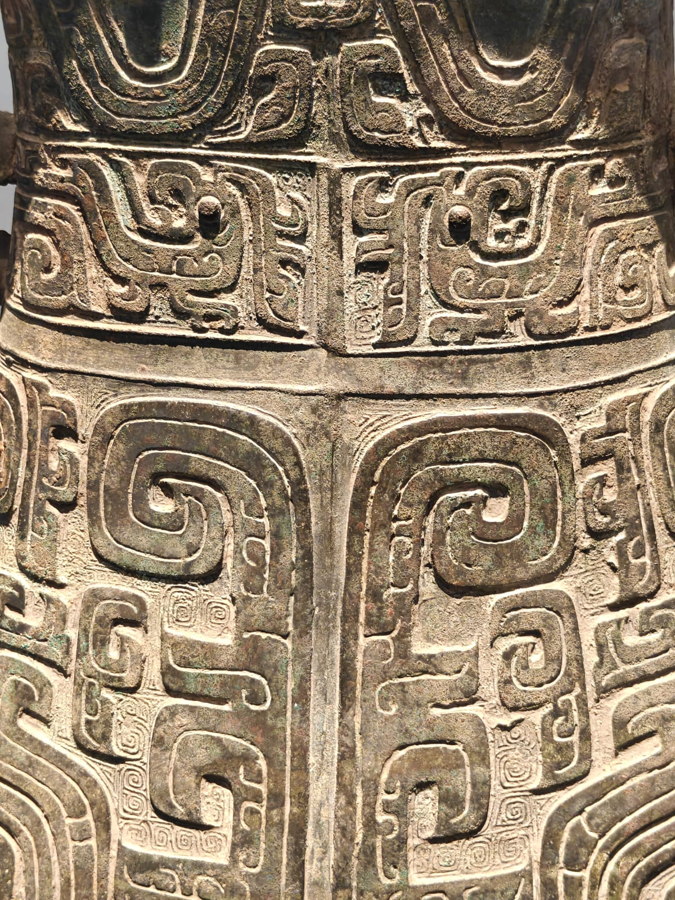
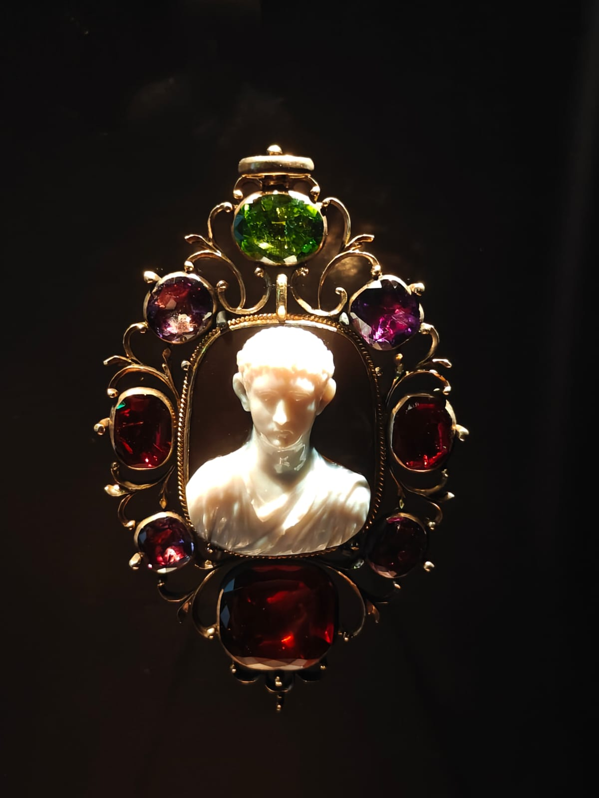
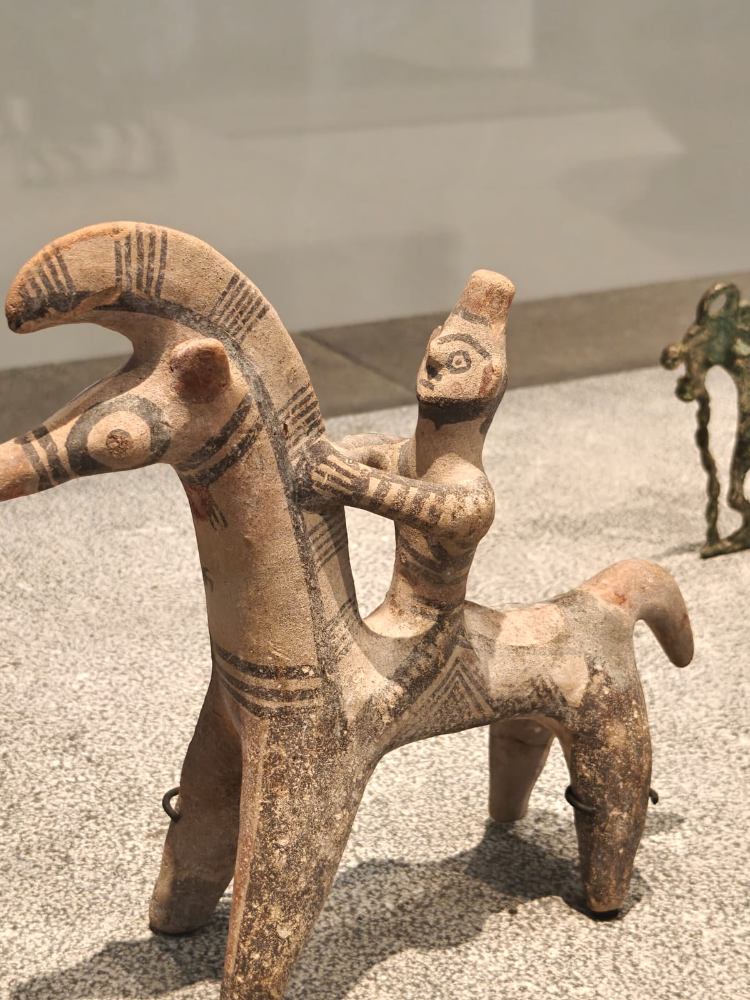
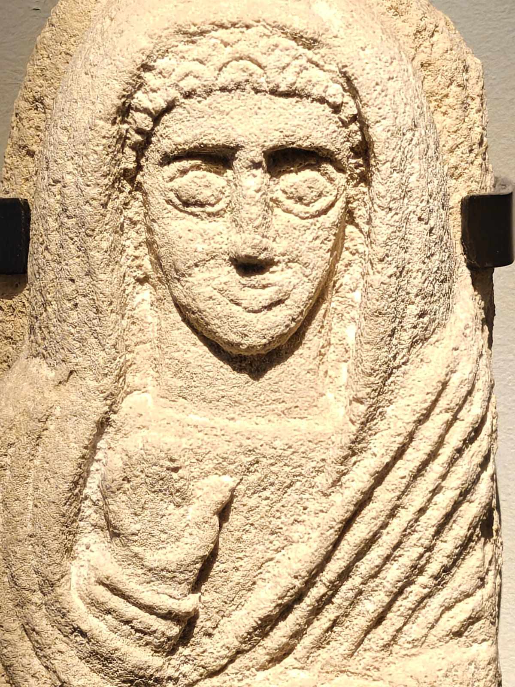
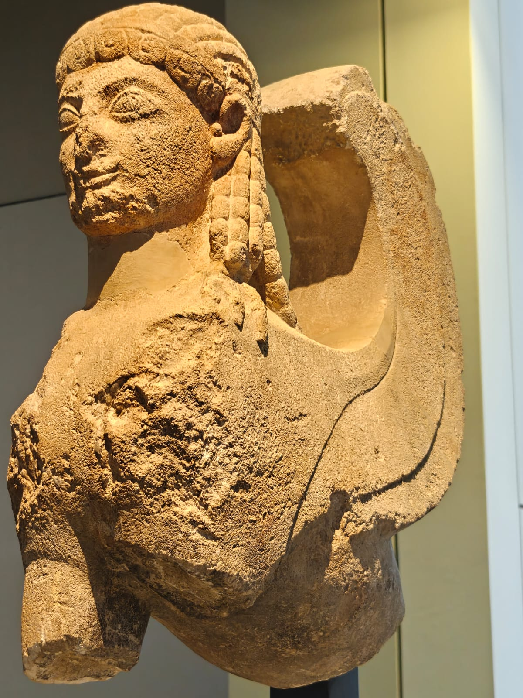
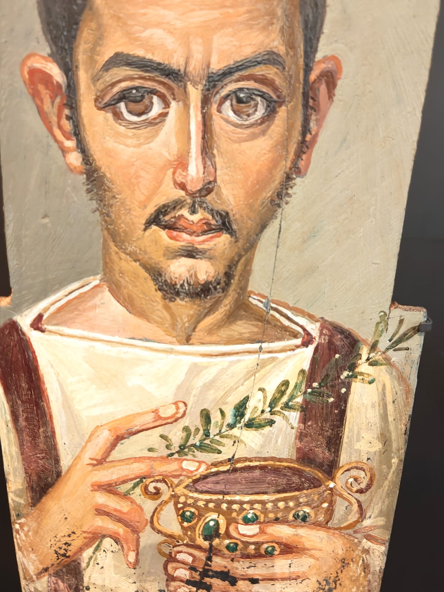
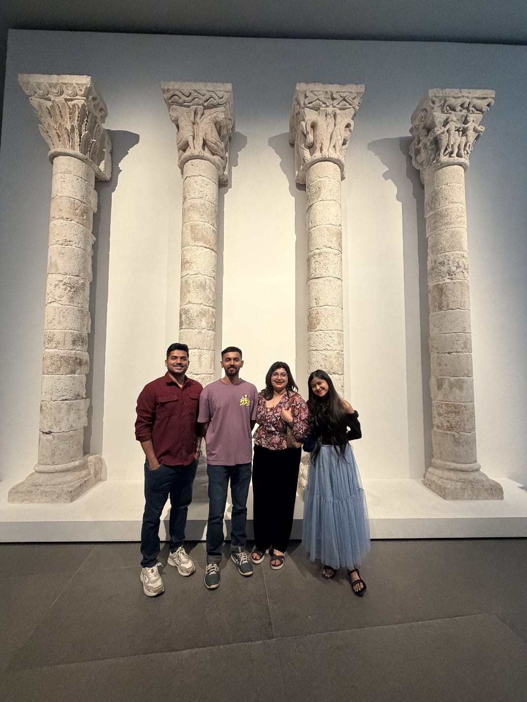
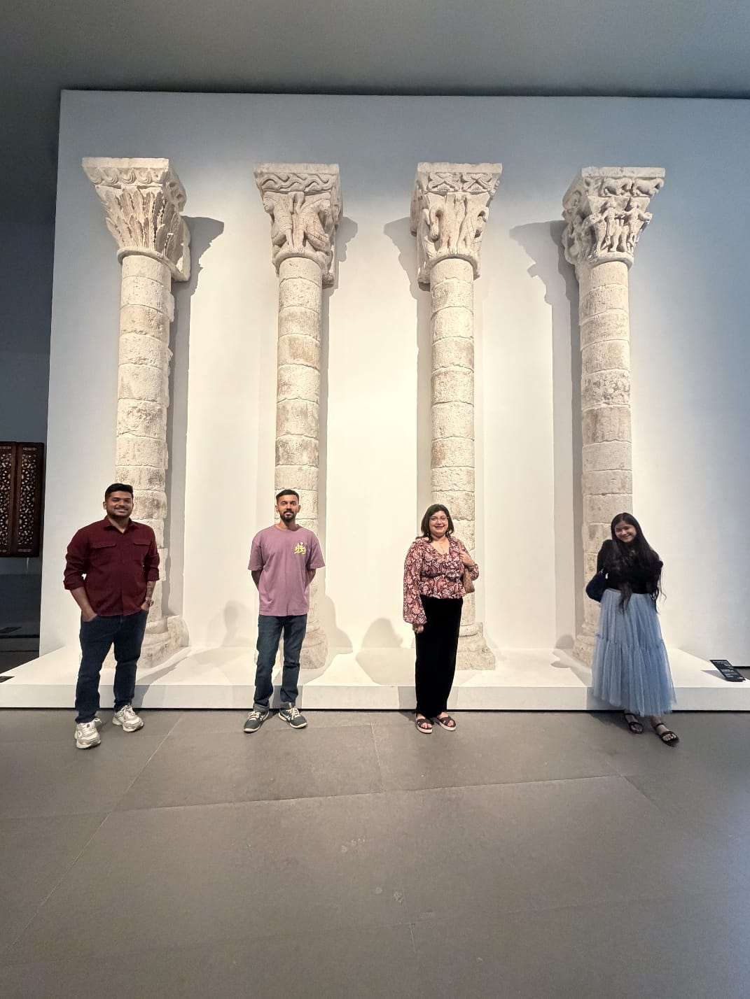

I recently moved to Abu Dhabi to join IIT Delhi Abu Dhabi as an IRA. It sounds exciting, and it is, but nobody tells you about the quiet part. None of my friends from Delhi are here. Every face around me is new, and I'm still learning names and finding my people. On top of that, my PhD is going through one of its harder phases, the kind where progress feels slow and the days start to blur. Put together, it has been a lonely stretch.

Then my sister **Aishu** came all the way from Dubai to see me, with her husband **Vipin** and her friend **Tabu**.

We went around the city together, and our big stop was the **Louvre Abu Dhabi**. Under its huge latticed dome the light falls in little patches, and the whole place feels calm, as if the building itself is telling you to slow down. We wandered from gallery to gallery with no reason to hurry: Arabic manuscripts and calligraphy, intricately patterned metalwork, a jewelled ornament of Augustus, a sphinx, and, to my surprise, an ancient Egyptian portrait of a man who looks suspiciously like me.

::: {.column-page}
```{=html}
<div class="collage-head"><span class="u-gold">$</span> ls ~/expeditions/louvre-abu-dhabi/gallery  <span class="u-muted"># 8 favourites · click to enlarge</span></div>
<div class="collage">
  <div class="collage-row">
    <a class="collage-item" style="--a:0.7500" href="images/arabic_book.jpeg" data-gallery="louvre" data-glightbox="description: An Arabic manuscript">
      
      <span class="cap">An Arabic manuscript</span>
    </a>
    <a class="collage-item" style="--a:0.7500" href="images/arabic_writing_on_utensil.jpeg" data-gallery="louvre" data-glightbox="description: Arabic calligraphy on a vessel">
      
      <span class="cap">Arabic calligraphy on a vessel</span>
    </a>
    <a class="collage-item" style="--a:0.7500" href="images/metal_object_with_beautiful_design.jpeg" data-gallery="louvre" data-glightbox="description: A metal vessel with beautiful designs">
      
      <span class="cap">A metal vessel with beautiful designs</span>
    </a>
    <a class="collage-item" style="--a:0.7500" href="images/ornament_with_augustus.jpeg" data-gallery="louvre" data-glightbox="description: A jewelled ornament with Augustus">
      
      <span class="cap">A jewelled ornament with Augustus</span>
    </a>
  </div>
  <div class="collage-row">
    <a class="collage-item" style="--a:0.7500" href="images/interesting_toy.jpeg" data-gallery="louvre" data-glightbox="description: An interesting toy: a rider on horseback">
      
      <span class="cap">An interesting toy: a rider on horseback</span>
    </a>
    <a class="collage-item" style="--a:0.7500" href="images/some_random_idol_which_looked_like_mother_mary.jpeg" data-gallery="louvre" data-glightbox="description: A carving that looked like Mother Mary">
      
      <span class="cap">A carving that looked like Mother Mary</span>
    </a>
    <a class="collage-item" style="--a:0.7500" href="images/sphinx.jpeg" data-gallery="louvre" data-glightbox="description: A sphinx">
      
      <span class="cap">A sphinx</span>
    </a>
    <a class="collage-item" style="--a:0.7500" href="images/this_egyptian_guy_looks_like_me.jpeg" data-gallery="louvre" data-glightbox="description: This Egyptian guy looks like me">
      
      <span class="cap">This Egyptian guy looks like me</span>
    </a>
  </div>
</div>
```
:::

For one whole day I wasn't the new guy on campus or the PhD student staring at a stubborn problem. I was just a brother out with his sister. We wrapped up the evening with dinner at a **Kerala restaurant**, and having family beside me in a city where I'm still a stranger made all the difference.

::: {.column-page}
```{=html}
<div class="collage-head"><span class="u-gold">$</span> ls ~/expeditions/louvre-abu-dhabi/squad</div>
<div class="collage">
  <div class="collage-row">
    <a class="collage-item" style="--a:0.7500" href="images/me_aishu_vipin_and_tabu_tabu_is_aishus_friend.jpeg" data-gallery="louvre" data-glightbox="description: Me, Aishu, Vipin and Tabu (Aishu's friend)">
      
      <span class="cap">Me, Aishu, Vipin and Tabu (Aishu's friend)</span>
    </a>
    <a class="collage-item" style="--a:0.7500" href="images/again_me_aishu_vipin_and_tabu.jpeg" data-gallery="louvre" data-glightbox="description: Same four, spread out between the columns">
      
      <span class="cap">Same four, spread out between the columns</span>
    </a>
    <div class="collage-note solo-m" style="--a:1.0000">
      <span class="ln u-muted"># day.log</span>
      <span class="ln"><span class="t">[day]</span> <span class="hl">Louvre Abu Dhabi</span> with Aishu, Vipin &amp; Tabu</span>
      <span class="ln"><span class="t">[night]</span> dinner at a <span class="hl">Kerala restaurant</span></span>
      <span class="ln"><span class="ok">✓</span> status: <span class="ok">best day in Abu Dhabi</span></span>
    </div>
  </div>
</div>
```
:::

It was, without a doubt, **my best day in Abu Dhabi so far**, and I enjoyed every bit of it. New cities take time to feel like home, and PhDs have their seasons. But days like this remind me that home is a feeling, and sometimes it comes all the way from Dubai to find you.

Thank you, Aishu (and Vipin and Tabu). ♛
