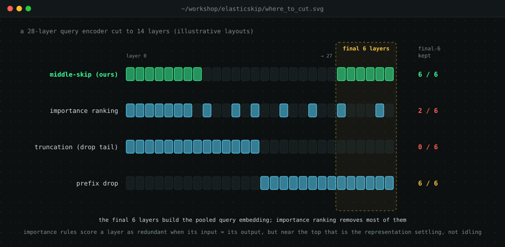
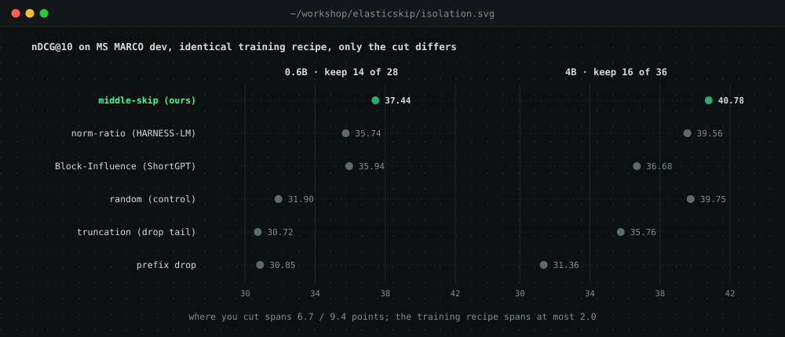
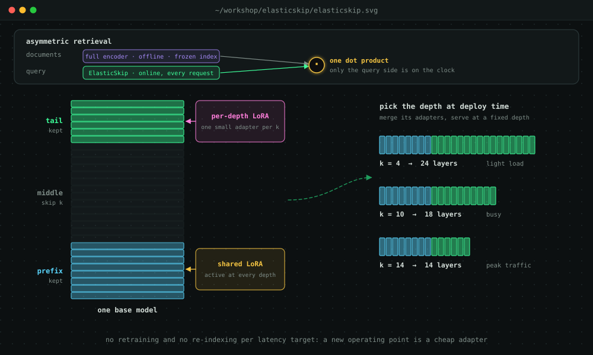
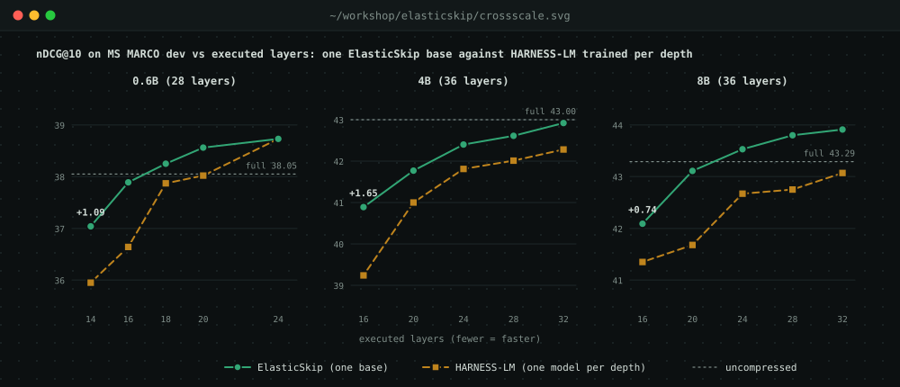

Every time you search, a large language model turns your query into a vector. The documents were embedded once, offline, and frozen into an index, so the query encoder is the only part that runs on every request. Making retrieval cheaper therefore means making the **query encoder** cheaper, and the bluntest tool for that is to delete whole transformer layers.

That raises a deceptively simple question: **which layers should you delete?** Our paper, *Where to Cut? Contiguous Middle-Skip Beats Importance Pruning for Dense-Retrieval Query Encoders*, finds that the popular answer is wrong for retrieval. It also turns the better answer into **ElasticSkip**, a query encoder that can run at any depth from a single base model.

## The inherited rule: prune by importance

Most layer-pruning work comes from *generative* LLMs, and it ranks layers by **importance**. ShortGPT's Block-Influence (BI) and HARNESS-LM's norm-ratio both score a layer as redundant when its output looks a lot like its input, and remove the most redundant ones. Nobody had really asked whether this is the right rule for retrieval.

We looked at what these rules actually delete in Qwen3-Embedding encoders (0.6B with 28 layers, 4B with 36). Both of them **thin the tail**. Of the final six layers, norm-ratio removes four at both sizes, and BI removes four at 0.6B and five at 4B. What they keep up there is scattered, never the contiguous final block.

{#fig-cut .column-page}

The reason is what these scores measure. Near the top of the network, a layer whose output resembles its input isn't idling; the representation is **settling**. For retrieval, that settling is exactly the work that matters.

## The isolation experiment

To test this cleanly, we fixed one compression recipe and varied *only* the layers removed. Every model goes through the same three stages:

1. **Structured removal.** Drop *k* layers; the rest keep their pretrained weights.
2. **Fidelity warm-start.** Train small LoRA adapters so the compressed model's query embeddings line up with the full model's, placing it in the right neighbourhood before any ranking objective.
3. **Denoised contrastive refinement.** Train for ranking with InfoNCE. MS MARCO labels only about one relevant document per query, so many "negatives" are really relevant but unlabelled. We mask the teacher's top-ranked documents out of the negative pool. HARNESS-LM does the same, and we don't claim it as new.

Then we compared six ways of choosing the layers, at an aggressive cut: keep 14 of 28 layers at 0.6B and 16 of 36 at 4B.

{#fig-isolation .column-page}

A **contiguous middle-skip** wins at both sizes: keep the early layers and the final block, and drop the middle. It beats norm-ratio by **+1.70** and **+1.22** nDCG@10, and Block-Influence by **+1.50** and **+4.10**. Norm-ratio is a strong baseline, but at 4B Block-Influence, the more aggressive tail-stripper, falls **below random layer removal**.

Two more observations stood out:

- **Keeping the tail is necessary but not sufficient.** Prefix-drop keeps all six final layers and is still among the weakest strategies. The early layers matter too.
- **Where you cut dwarfs how you train.** Across strategies, nDCG@10 spans **6.72** (0.6B) and **9.42** (4B) points. Swapping the training objective moves it by at most **2.03**. At 4B, middle-skip with the *worst* objective (39.59) still ties norm-ratio with the *best* one (39.56).

## Why the tail matters

We probed the encoder to see what the final layers do.

- **They purify the query.** Probing each layer, "concept" information (what the query is about) stays readable throughout, while "surface" information (its exact form, such as length) steadily fades. The two cross around layer 18, and the concept margin keeps growing to the top.
- **The readout aligns on concepts.** Inside the network, query and document embeddings look similar for shallow reasons: even a *random* document scores 0.92 cosine at a late hidden layer. Only at the final output does the surface agreement collapse while the concept agreement survives. That is where a query and its relevant document actually meet.
- **The causal test.** At a fixed number of executed layers, we swapped tail layers for random middle layers. Quality falls steadily: at 0.6B from 37.44 to 32.11, and at 4B from 40.78 to 36.28. The drop is convex, so the last tail layers are worth 4 to 6 times the first ones. With no tail at all, a model lands in the same tier as plain truncation. Importance pruning gives up the tail, not the depth.

There's a lesson about distillation here too. Across 63 trained checkpoints, how closely a compressed model copies its teacher's embeddings tracks ranking quality only loosely. The correlation is r = 0.49 at 0.6B and r = 0.81 at 4B, and it carries almost no signal for any individual query. One example: ElasticSkip at depth 14 is *less* faithful to the teacher than prefix-drop (cosine 0.52 vs 0.55) yet ranks **6.2 points** better. Retrieval reads each embedding through a single dot product, so copying the teacher is neither necessary nor sufficient for ranking well.

## ElasticSkip: one base, every depth

{#fig-arch .column-page}

ElasticSkip packages the winning cut as a deployable system:

- **Contiguous middle-skip.** Run the prefix and the tail and skip a middle block of width *k*.
- **Depth-specific low-rank compensation.** A **shared** LoRA adapter on the prefix is active at every depth, and a small **per-depth** adapter sits on the tail. One base model plus a handful of adapters covers the whole speed–quality trade-off.
- **Depth is a deployment choice.** Pick *k* to fit the latency budget, merge its adapters into the weights, and serve at a fixed depth. A new operating point is a cheap adapter, not a new model, and the document index never has to be rebuilt.

We compared one ElasticSkip base against HARNESS-LM, the state-of-the-art compression method, trained **separately for each depth**, at 0.6B, 4B and 8B:

{#fig-crossscale .column-page}

ElasticSkip beats the per-depth baseline at **14 of the 15** operating points, by **+0.38 to +1.65**, and ties the 15th (0.6B at 24 layers). The gap is largest under aggressive compression. At 8B, the 32-layer ElasticSkip even **beats its own uncompressed teacher** (43.91 vs 43.29), because the refinement stage sharpens ranking on MS MARCO.

Sharing one base across depths is mainly a deployment convenience at 0.6B, where it costs a hair: −0.10 on average against a single-depth middle-skip model. At 4B and 8B it turns into a small, consistent **gain** of +0.37 and +0.76.

**It holds out of domain.** On 11 BEIR datasets, zero-shot at the most aggressive cut, ElasticSkip averages **43.70 vs 41.79** for HARNESS-LM at 0.6B (winning 10 of 11 datasets) and **48.96 vs 46.14** at 4B (9 of 11). The margins are larger out of domain than in domain, and largest on big corpora with a million or more documents, where near-miss distractors make concept purity count. A fixed structural cut needs no calibration data, so it transfers.

## Caveats

- The isolation and cross-scale results are **single-seed**; the tail-swap ablation uses three seeds.
- Keeping the tail is **necessary, not sufficient**: the early layers matter as well.
- The denoised contrastive stage is shared with HARNESS-LM. Our gains come from *where* we cut, not from a new loss.

## Takeaways

- **Where you cut matters more than how you heal the cut.** Choosing layers moved quality up to 9.4 points; the training recipe, about 2.
- **Retrieval needs its tail.** The final layers build the concept-level embedding that the dot product reads.
- **Don't chase the teacher's hidden states.** Imitation fidelity is a weak proxy for ranking.
- **One model, many depths.** ElasticSkip replaces a family of compressed encoders with one base and a few adapters.

## Read more

- 📄 Paper (preprint): [*Where to Cut? Contiguous Middle-Skip Beats Importance Pruning for Dense-Retrieval Query Encoders*](https://drive.google.com/file/d/1UYIGJPfBTWnW6OxifBpDc5IctFe1RNsC/view?usp=sharing)

This is joint work with Deepak Saini and Aamod Khatiwada, advised by Sumeet Agarwal and Manik Varma.

## The poster

Here's our poster. Click it to zoom, or [download the PDF](elasticskip_poster.pdf).

{#fig-poster}
