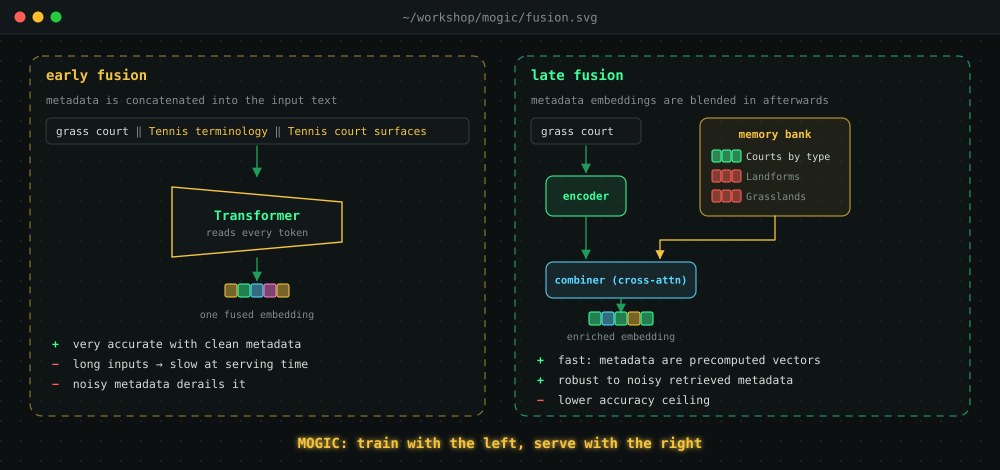
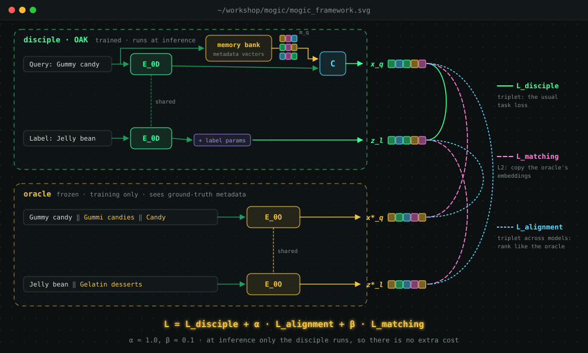
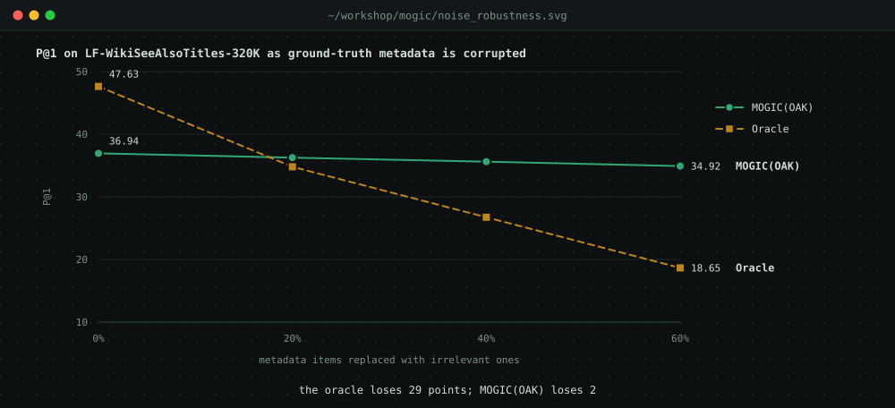
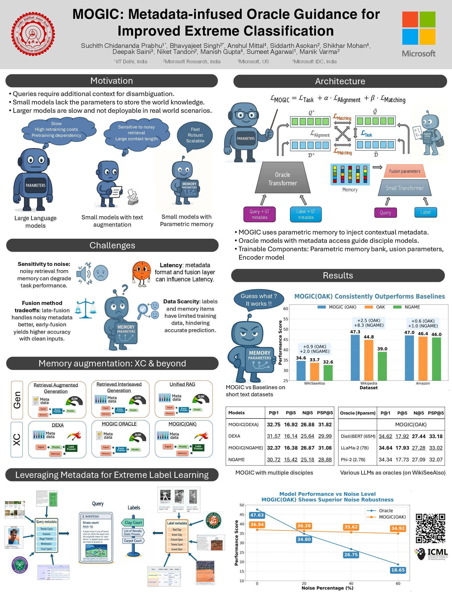

Type *"grass court"* into a search engine and you expect tennis: clay courts, hard courts, Wimbledon. Now imagine a model that also looks up extra context for the query and finds *"Landforms"* and *"Grasslands"*. Suddenly it's recommending articles about Texas and Nevada state prisons. That really happened to a state-of-the-art model in our experiments, and fixing it is what our ICML 2025 paper, **MOGIC**, is about.

## Short queries, millions of labels

In **extreme classification (XC)**, a short query must be matched to the handful of relevant labels out of *millions*: search queries to advertiser keywords, products to products that are bought together, Wikipedia pages to the categories they belong to. Two things make this hard:

- **Queries are tiny.** A few words rarely say enough on their own.
- **Data is sparse.** With millions of labels, most have only a few training examples.

So XC models lean on **metadata**, extra text that explains the query. A Wikipedia page can be described by the pages it links to or the categories it's tagged with. A search query can be described by the titles of pages people clicked for it. In the papers and code this metadata is called **memory**, and each piece of it is a *memory item*.

The catch: clean, human-curated links to metadata exist at training time, but in production they usually don't. Around 80–85% of real traffic is *cold-start*, so the model has to **predict** which memory items are relevant, and predictions are noisy.

## Two ways to use memory

{#fig-fusion .column-page}

**Early fusion** simply glues the metadata text onto the query and lets a transformer read it all. With ground-truth metadata it is superb: **47.63** precision@1 (P@1) on LF-WikiSeeAlsoTitles-320K. But longer inputs mean slower serving. And when the metadata is *predicted*, the model believes whatever it's handed and falls to **28.49**.

**Late fusion**, used by OAK (the previous state of the art), keeps a *memory bank* of metadata embeddings. It retrieves a few and blends them into the query embedding with one cross-attention layer. It's fast and shrugs off noise (**33.71** with predicted metadata). But even with perfect metadata it reaches only **38.92**, far below early fusion.

One approach is accurate but fragile and slow; the other is fast and robust but has a lower ceiling. MOGIC asks whether we can **train with the first and serve with the second**.

## The MOGIC recipe

{#fig-mogic .column-page}

### Phase 1: train an oracle

The oracle is an early-fusion encoder that gets **privileged information**: the query *and* the label, each concatenated with its **ground-truth** metadata as text (`Gummy candy ‖ Gummi candies ‖ Candy`). It's trained with a standard triplet loss that pulls relevant labels close to the query in embedding space and pushes irrelevant ones away. We tried three oracles: a fully finetuned DistilBERT, and LoRA-finetuned Phi-2 and LLaMA-2.

The oracle is excellent and completely impractical: it needs metadata we won't have at serving time, and it's slow. So we never deploy it. It's a teacher who has seen the answer key.

### Phase 2: guide a disciple

The disciple is any fast XC model. Our main one is OAK, which has a shared text encoder, a memory bank with a combiner, and a few free parameters per label. It keeps training on its usual task loss, plus two extra losses that point it toward the **frozen** oracle:

- **Alignment** makes the two models rank alike. It is a triplet loss *across* models: the disciple's query embedding should rank the *oracle's* label embeddings correctly, and vice versa.
- **Matching** makes the disciple's embeddings land where the oracle's do, using a simple L2 distance.

$$
\mathcal{L}_{\text{MOGIC}} = \mathcal{L}_{\text{Disciple}} + \alpha\,\mathcal{L}_{\text{Alignment}} + \beta\,\mathcal{L}_{\text{Matching}}, \qquad \alpha = 1,\ \beta = 0.1
$$

At inference time the oracle disappears. Only the disciple runs, with its usual predicted metadata, so MOGIC adds **no serving cost at all**.

### Isn't this just knowledge distillation?

It's a cousin, with three twists. The oracle sees **ground-truth metadata** the disciple never gets, so it isn't simply a bigger copy of the student. Knowledge flows from an *early-concatenation* model into a *two-tower, memory-based* model, and the memory's free parameters are shaped by the guidance. And the teacher doesn't have to be bigger: our recommended oracle is a 65M-parameter DistilBERT, the same size as the disciple.

We also back this with a guarantee. Under simplifying assumptions, a disciple trained with the Alignment and Matching losses has an expected loss at most the *oracle's* expected loss, plus a term that shrinks as the number of training samples $N$ grows:

$$
\mathbb{E}\big[\mathcal{L}_{\text{Disciple}}\big] \;\le\; \mathbb{E}\big[\mathcal{L}_{\text{Oracle}}\big] + \tfrac{4K}{N}(R_q + R_l) + 2\sqrt{\tfrac{\log(1/\delta)}{N}}
$$

In words: the disciple can inherit the oracle's quality.

## Results

MOGIC(OAK) beats OAK on every benchmark. Here are precision@1 and propensity-scored precision@5 (PSP@5, which rewards getting rare labels right):

| Dataset | OAK P@1 | MOGIC(OAK) P@1 | OAK PSP@5 | MOGIC(OAK) PSP@5 |
|---|---:|---:|---:|---:|
| LF-WikiSeeAlsoTitles-320K | 33.71 | **34.62** | 30.83 | **33.18** |
| LF-WikiTitles-500K | 44.82 | **47.28** | 24.90 | **26.12** |
| LF-AmazonTitles-131K | 46.42 | **47.01** | 49.78 | **50.33** |

The gains show up consistently on **tail labels**, the rare ones with little training data. It also beats graph-based methods such as GraphFormers and GraphSage by about 8%, even though those were given ground-truth metadata at inference time.

**It's plug-and-play.** MOGIC doesn't need a memory-based disciple. On LF-WikiSeeAlsoTitles-320K it lifts NGAME from 30.72 to **32.37** P@1 and DEXA from 31.57 to **32.75**.

**Both guidance losses matter.** On LF-WikiSeeAlsoTitles-320K, P@1 is 33.71 with the task loss alone. Adding only Alignment gives 34.12, adding only Matching gives 34.11, and adding both gives **34.62**. Dropping the task loss and keeping only the guidance falls to 32.70, so the disciple still needs its own objective.

**A better oracle isn't a bigger one.** On its own, the DistilBERT oracle reaches 47.63 P@1, while the LoRA-tuned LLaMA-2 manages 34.20 and Phi-2 33.32. Yet as *teachers* they are almost interchangeable: the disciple reaches 34.62, 34.64 and 34.34 respectively. The 65M model teaches as well as the 7B one.

### Robust where the oracle is fragile

This is perhaps the most striking result. We took ground-truth metadata and progressively replaced a share of it with irrelevant items:

{#fig-noise}

At 60% noise the oracle loses 29 points of P@1, but the disciple it trained loses only 2. Missing metadata is handled just as gracefully: shrinking the memory bank to 40% of its size moves MOGIC(OAK) from 34.62 to only 34.17. The disciple learned *what the oracle knows* without inheriting *how it breaks*.

### The grass court, revisited

Here are the top-5 predictions for two queries, before and after MOGIC. `+` marks a correct label and `-` a wrong one:

```{=html}
<div class="pred-diff">
  <div class="pd-col"><div class="pd-head">OAK <span class="u-muted">· "Grass court"</span></div><div class="pd-body">
    <span class="bad">Fernie Ghostriders</span><span class="bad">Garland, Texas</span><span class="bad">List of Nevada state prisons</span><span class="bad">Ronald Reagan Boyhood Home</span><span class="bad">West End (Richmond, Virginia)</span>
  </div></div>
  <div class="pd-col"><div class="pd-head">MOGIC(OAK) <span class="u-muted">· "Grass court"</span></div><div class="pd-body">
    <span class="ok">Clay court</span><span class="ok">Carpet court</span><span class="ok">Hardcourt</span><span class="bad">Video arcade</span><span class="bad">U.S. Men's Clay Court Championships</span>
  </div></div>
  <div class="pd-col"><div class="pd-head">OAK <span class="u-muted">· "Tangbe"</span></div><div class="pd-body">
    <span class="bad">Desalpur</span><span class="bad">Second Franco-Dahomean War</span><span class="bad">Vladivostok</span><span class="bad">Kitenge</span><span class="bad">List of currently erupting volcanoes</span>
  </div></div>
  <div class="pd-col"><div class="pd-head">MOGIC(OAK) <span class="u-muted">· "Tangbe"</span></div><div class="pd-body">
    <span class="ok">Mustang District</span><span class="ok">Kali Gandaki Gorge</span><span class="ok">Kali Gandaki River</span><span class="ok">Upper Mustang</span><span class="ok">Gandaki River</span>
  </div></div>
</div>
```

For *"Grass court"*, both models see the same misleading memory items (*Landforms*, *Grasslands*). OAK follows them into geography. MOGIC(OAK), shaped by an oracle that knew the query was about *tennis court surfaces*, keeps the query's real intent.

## Takeaways

- **Train with privileged information, serve without it.** Ground-truth metadata is too good to waste, even if you can't use it in production.
- **Guidance beats imitation of size.** A small oracle with the right information teaches as well as a 7B model.
- **Robustness can be distilled selectively.** The disciple picked up the oracle's accuracy but not its fragility.

## Read more

- 📄 Paper: [OpenReview](https://openreview.net/forum?id=uxA0GI240s)
- 💻 Code: [github.com/suchith720/mogic](https://github.com/suchith720/mogic)

This was joint work with Bhavyajeet Singh (equal contribution) and a wonderful team from IIT Delhi, Microsoft Research India and Microsoft, advised by Sumeet Agarwal and Manik Varma.

## The poster

Here's our poster. Click it to zoom, or [download the PDF](mogic_icml25_poster.pdf).

{#fig-poster}
