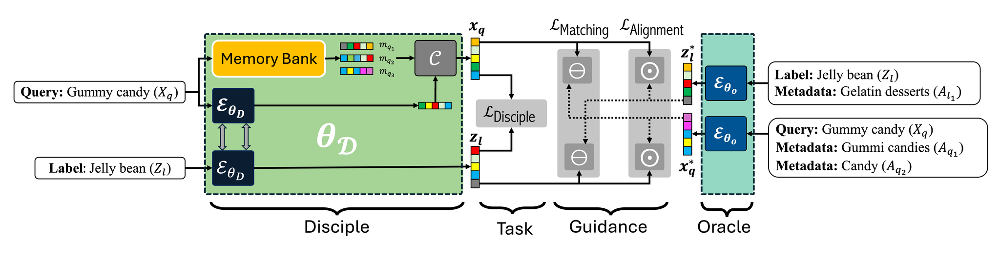

Type *"grass court"* into a search engine and you expect tennis: clay courts, hard courts, Wimbledon. Now imagine a model that also looks up extra context for the query and finds *"Landforms"* and *"Grasslands"*. Suddenly it's recommending geography articles. That really happened to a state-of-the-art model in our experiments, and fixing it is what our ICML 2025 paper, **MOGIC**, is about.

## The setting: extreme classification

In **extreme classification (XC)**, a short query must be matched to the few relevant labels out of *millions*: search queries to ads, products to products, Wikipedia pages to categories. Queries are only a few words long, so models lean on **metadata** (related pages, categories, clicked titles) to understand what the query really means.

There are two ways to feed that metadata to a model, and each has a catch:

- **Early fusion** pastes the metadata text into the input. It's very accurate when the metadata is correct: 47.63 precision@1 on LF-WikiSeeAlsoTitles-320K with ground-truth metadata. But it's slow, and it collapses when the metadata is noisy, dropping to 28.49 with predicted metadata.
- **Late fusion**, used by OAK (the prior state of the art), blends metadata *embeddings* in at the end. It's fast and robust to noise (33.71), but with clean metadata it only reaches 38.92, far below early fusion.

In deployment, most traffic is cold-start, so ground-truth metadata simply isn't there. We wanted early-fusion quality at late-fusion speed.

## The idea: an oracle and a disciple

MOGIC trains in two phases:

1. **Oracle.** Train an early-fusion model that sees the query, the label *and* their ground-truth metadata as text. It's accurate but impractical to deploy, a bit like a teacher who has already seen the answer key.
2. **Disciple.** Train a fast late-fusion model such as OAK as usual, with two extra losses that pull it toward the frozen oracle:
   - **Alignment**: the disciple's queries must rank the oracle's labels correctly, and vice versa.
   - **Matching**: the disciple's embeddings should sit close to the oracle's.

$$
\mathcal{L}_{\text{MOGIC}} = \mathcal{L}_{\text{Disciple}} + \alpha\,\mathcal{L}_{\text{Alignment}} + \beta\,\mathcal{L}_{\text{Matching}}
$$

{#fig-mogic}

At inference time the oracle is gone. Only the disciple runs, so MOGIC costs **nothing extra** at serving time.

## Does it work?

Yes. Precision@1 of MOGIC(OAK) against OAK:

| Dataset | OAK | MOGIC(OAK) |
|---|---:|---:|
| LF-WikiSeeAlsoTitles-320K | 33.71 | **34.62** |
| LF-WikiTitles-500K | 44.82 | **47.28** |
| LF-AmazonTitles-131K | 46.42 | **47.01** |

A few more findings I'm proud of:

- **Robust to noise.** Corrupt 60% of the metadata and the oracle falls from 47.63 to 18.65 P@1, while MOGIC(OAK) only slips from 36.94 to 34.92.
- **Plug-and-play.** The same recipe improves memory-free models such as NGAME and DEXA.
- **Any oracle works.** DistilBERT, Phi-2 and LLaMA-2 all make good teachers, and the 65M-parameter DistilBERT does about as well as the 7B LLaMA-2.

And the *"grass court"* query from the start? MOGIC(OAK) now predicts clay court, carpet court and hardcourt.

## Read more

- 📄 Paper: [OpenReview](https://openreview.net/forum?id=uxA0GI240s)
- 💻 Code: [github.com/suchith720/mogic](https://github.com/suchith720/mogic)

This was joint work with Bhavyajeet Singh (equal contribution) and a wonderful team from IIT Delhi, Microsoft Research India and Microsoft, advised by Sumeet Agarwal and Manik Varma.

## The poster

Here's our poster. Click it to zoom, or [download the PDF](mogic_icml25_poster.pdf).

{#fig-poster}
